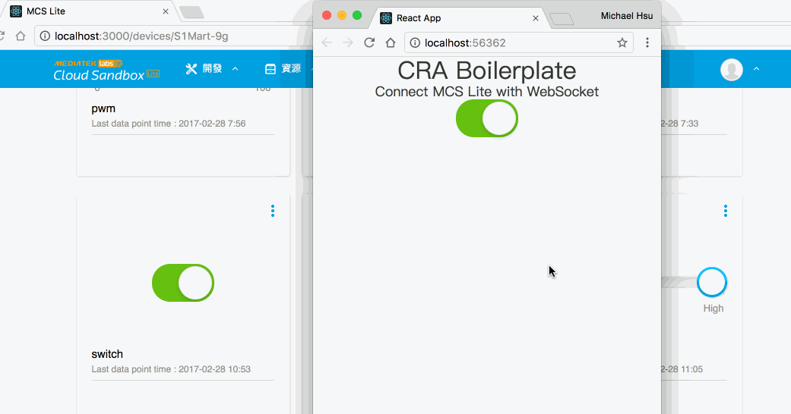

# cra-boilerplate [](https://travis-ci.org/MCS-Lite/cra-boilerplate) [](https://greenkeeper.io/)


> Create a MCS Lite Web App based on Create-React-App.

-   Try it online - http://cra-boilerplate.netlify.com/



## Usage

```
$ yarn install
$ yarn start
```

> User Guide: https://github.com/facebookincubator/create-react-app

## CONTRIBUTING

* ⇄ Pull requests and ★ Stars are always welcome.
* For bugs and feature requests, please create an issue.
* Pull requests must be accompanied by passing automated tests (`$ npm test`).

## [CHANGELOG](CHANGELOG.md)
## [LICENSE](LICENSE)
## [COMMIT_LOG](COMMIT_LOG.md)
